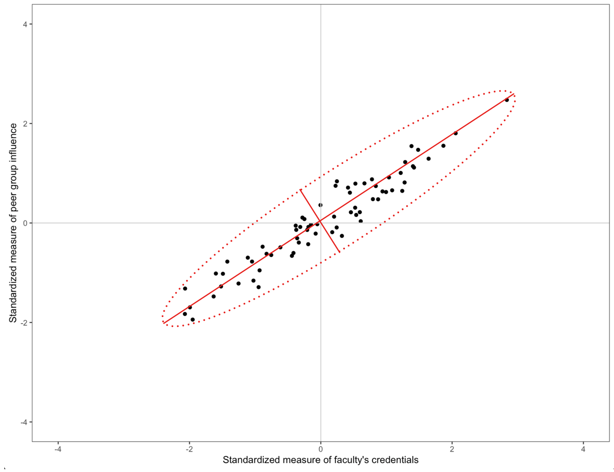

```{r knitr_init, echo=FALSE, cache=FALSE, message=FALSE}
library(knitr)
library(kableExtra)
library(rmdformats)

## Global options
options(max.print = "75")
opts_chunk$set(
  echo=TRUE,
  prompt=FALSE, 
  comment=NA, 
  message=FALSE, 
  warning=FALSE, 
  tidy=FALSE, 
  fig.width=6, 
  fig.height=6,
  fig.align='center', 
  out.width='40%'
  )
opts_knit$set(width=85)
options(scipen=5)
```

In 1964, the US Congress passed the Civil Rights Act and also ordered a survey of school districts to evaluate the availability of equal educational opportunity in public education. The results of this survey were reported on in @Coleman:1966 and @Mosteller:1972. We will use a subset of the data collected (in *equal-educational-opportunity.csv*) to mimic one of the original regression analyses performed; examining whether the level of school facilities was an important predictor of student achievement after accounting for the variation in faculty credentials and peer influence.

- [[CSV]](https://raw.githubusercontent.com/zief0002/epsy-8264/master/data/equal-educational-opportunity.csv)
- [[R Script File]](https://raw.githubusercontent.com/zief0002/epsy-8264/master/scripts/f21-10-pca-via-spectral-decomposition.R)

The data come from a random sample of 70 schools in 1965. The variables, which have all been mean-centered and standardized, include:

- `achievement`: Measurement indicating the student achievement level
- `faculty`: Measurement indicating the faculty's credentials
- `peer`: Measurement indicating the influence of peer groups in the school
- `school`: Measurement indicating the school facilities (e.g., building, teaching materials)

```{r}
# Load libraries
library(broom)
library(car)
library(corrr)
library(tidyverse)
library(patchwork)

# Read in data
eeo = read_csv("~/Documents/github/epsy-8264/data/equal-education-opportunity.csv")
head(eeo)

# Source the residual_plots() function from the script file
source("../../scripts/residual_plots.R")
```

The problem we faced from the last set of notes, was that the predictors in the model were collinear, so we encountered computational issues when trying to estimate the effects and standard errors. One method to deal with collinearity among a set of predictors is to combine the predictors into a smaller subset of orthogonal measures (called principal components) that can be used instead of the original predictors. This subset of measures will not have the collinearity problems (they are orthogonal to one another), but constitute a slightly smaller amount of "variance accounted for" than the original set of predictors. 

<br />


# Idea of Principal Components

If the *X*-matrix of the predictors were orthogonal, there would be no collinearity issues and we could easily estimate the effects and standard errors. This is, of course, not the case in our example in which the predictors are highly correlated. A scatterplot representing the relationship between two of the three predictors from our EEO data is shown on the left-hand side of the figure below. We can see the highly correlated nature of these variables in the plot. 


The idea of principal components analysis is to rotate the basis vectors (coordinate system) so that the axes of the rotated basis correspond to the primary axes of the data ellipse. (Such a rotation of the basis vectors is shown in the center panel of the figure below.) When the coordinates of the predictors are expressed in this new coordinate system, the corresponding 'variables' are orthogonal to one another. The new coordinates of the observations (under the rotated basis vectors) is shown in the right-hand side of the figure below.

```{r fig.width=12, fig.height=4, fig.show="hold", fig.cap="LEFT: Faculty credential and peer influence measures shown in the coordinate system given by the $(1,0)$-$(0,1)$ basis. CENTER: The coordinate system has been rotated based to a new basis. RIGHT: The new coordinates of the observations based on the rotated coordinate space.", echo=FALSE}
X = as.matrix(eeo[ , c("faculty", "peer")])

rot = eigen(crossprod(X))$vectors
new_X = data.frame(X %*% -rot)
names(new_X) = c("faculty", "peer")

# Original basis
p1 = ggplot(data = eeo, aes(x = faculty, y = peer)) +
  geom_point() +
  geom_hline(yintercept = 0, color = "lightgrey") +
  geom_vline(xintercept = 0, color = "lightgrey") +
  geom_segment(x = 0, xend = 1, y = 0, yend = 0, arrow = arrow(length = unit(0.15,"cm")), color = "#E71D36", size = 1.25) +
  geom_segment(x = 0, xend = 0, y = 0, yend = 1, arrow = arrow(length = unit(0.15,"cm")), color = "#E71D36", size = 1.25) +
  scale_x_continuous(name = "Standardized measure of faculty's credentials", limits = c(-4, 4)) +
  scale_y_continuous(name = "Standardized measure of peer group influence", limits = c(-4, 4)) +
  theme_bw() +
  theme(
    panel.grid.major = element_blank(),
    panel.grid.minor = element_blank()
  )

# Rotated space
p2 = ggplot(data = eeo, aes(x = faculty, y = peer)) +
  geom_point()  +
  geom_abline(intercept = 0, slope = 0.8484635, color = "lightgrey") +
  geom_abline(intercept = 0, slope = -1.178601, color = "lightgrey") +
  geom_segment(x = 0, xend = 0.7625172, y = 0, yend = 0.6469680, arrow = arrow(length = unit(0.15,"cm")), color = "#E71D36", size = 1.25) +
  geom_segment(x = 0, xend = 0.6469680, y = 0, yend = -0.7625172, arrow = arrow(length = unit(0.15,"cm")), color = "#E71D36", size = 1.25) +
  scale_x_continuous(name = "Standardized measure of faculty's credentials", limits = c(-4, 4)) +
  scale_y_continuous(name = "Standardized measure of peer group influence", limits = c(-4, 4)) +
  theme_bw()

# New coordinates in the rotated space
eeo_pred = eeo %>%
  select(faculty, peer)

# Create princomp object
my_pca = princomp(eeo_pred)

p3 = data.frame(my_pca$scores) %>%
  ggplot(aes(x = Comp.1, y = Comp.2)) +
  geom_point() +
  geom_hline(yintercept = 0, color = "lightgrey") +
  geom_vline(xintercept = 0, color = "lightgrey") +
  geom_segment(x = 0, xend = 1, y = 0, yend = 0, arrow = arrow(length = unit(0.15,"cm")), color = "#E71D36", size = 1.25) +
  geom_segment(x = 0, xend = 0, y = 0, yend = -1, arrow = arrow(length = unit(0.15,"cm")), color = "#E71D36", size = 1.25) +
  scale_x_continuous(name = "Principal component 1", limits = c(-4, 4)) +
  scale_y_continuous(name = "Principal component 2", limits = c(-4, 4)) +
  theme_bw() +
  theme(
    panel.grid.major = element_blank(),
    panel.grid.minor = element_blank()
  )
  

# Layout plots
p1 | p2 | p3
```

If we had considered all three predictors, the plot would be in three-dimensional space and we would need to rotate the coordinate system formed by the basis vectors (1, 0, 0)-(0, 1, 0)-(0, 0, 1). With three dimensions, of course, we can now rotate in multiple directions. This idea can also be extended to *k*-dimensional space. (For now, to keep it simple, we will continue to work with the predictor space defined by the `faculty` and `peer` predictors.)

Recall from the chapter [Basis Vectors and Matrices](https://zief0002.github.io/matrix-algebra/basis-vectors-and-matrices.html), that transforming the coordinates for a point to a new basis is a simple matter of pre-multiplying the vector of original coordinates by the matrix composed of the basis vectors. For example, the first observation in the `eeo` data had a `faculty` value of 0.608, and a `peer` value of 0.0351. If we transform this using a new set of basis vectors, say 

$$
\begin{bmatrix}0.7625172 & 0.6469680 \\ 0.6469680 & -0.7625172\end{bmatrix}
$$

Then the same point has the coordinates (0.486, 0.367) under the new basis.

```{r}
# Coordinates in original predictor space (row vector)
old = t(c(0.608, 0.0351))

# Matrix of new basis vectors
basis = matrix(c(0.7625172, 0.6469680, 0.6469680, -0.7625172), nrow = 2)

# Coordinates in rotated predictor space
old %*% basis 
```


## Determining the Principal Components

The set of rotated basis vectors, referred to as the set of *principal components*, is chosen so that: 

(1) the basis vectors are orthogonal to one another, and 
(2) to maximize variance in the predictor space. For example, the direction of the first basis vector (i.e., the first principal component) is chosen to maximize the variation in the predictor space. 

Maximizing the variation in the predictor space essentially boils down to rotating the basis so that one of the basis vectors points in the direction of the major axis in the data ellipse. The second principal component is then chosen to maximize variance in an orthogonal direction to the first principal component. (With only two predictors, there is only one possible direction for the second principal component.) In our data ellipse this would be the direction of the minor axis. If the predictor space has more than two dimensions, this process continues until we exhaust the number of principal components.


```{r fig.width=6, fig.height=6, fig.cap="Data ellipse showing the directions of the principal components. The first principal component is in the direction of the major axis and the second principal component is in the direction of the minor axis.", echo=FALSE}

```

Finding the rotated set of basis vectors essentially comes down to determining the eigenvalues and eigenvectors for the matrix $\mathbf{X}_p^\intercal\mathbf{X}_p$, where $\mathbf{X}_p$ is a matrix of the predictors. Since this matrix is square, we can use [spectral decomposition (i.e., eigen decomposition)](https://zief0002.github.io/matrix-algebra/spectral-decompostion.html) to decompose this matrix as follows:

$$
\mathbf{X}_p^\intercal\mathbf{X}_p = \mathbf{PDP}^\intercal
$$

where the columns of **P** are the eigenvectors of the $\mathbf{X}_p^\intercal\mathbf{X}_p = \mathbf{PDP}^\intercal$ matrix, and **D** is a diagonal matrix whose diagonal elements are composed of the eigenvalues of the $\mathbf{X}_p^\intercal\mathbf{X}_p = \mathbf{PDP}^\intercal$ matrix. 

The matrices **P** and $\mathbf{P}^\intercal$ are both orthogonal basis matrices that ultimately act to change the coordinate system by rotating the original basis vectors used in the predictor space. The **D** matrix is diagonalizing the $\mathbf{X}_p^\intercal\mathbf{X}_p$ matrix which amounts to finding the the major axes in the data ellipse along which our data varies. 

<br />

### Matrix Algebra to Carry Out the PCA using Spectral Decomposition


To carry out the spectral decomposition in R, we need to create the matrix of the predictors ($\mathbf{X}_p$), compute the $\mathbf{X}_p^\intercal\mathbf{X}_p = \mathbf{PDP}^\intercal$ matrix, and then use the `eigen()` function to carry out the spectral decomposition.

```{r}
# Create predictor matrix
X_p = eeo %>%
  select(peer, faculty) %>%
  data.matrix()

# Spectral decomposition
spec_decomp = eigen(t(X_p) %*% X_p)
spec_decomp
```

The matrix of eigenvectors, in the `$vectors` component, compose the **P** matrix and make up the set of basis vectors for the rotated predictor space. The elements in the `$values` component are the diagonal elements in **D** and are the eigenvalues. The decomposition is:

$$
\begin{split}
\mathbf{X}^{\intercal}_p\mathbf{X}_p &= \mathbf{PDP}^\intercal \\[1em]
\begin{bmatrix}59.16 & 66.52 \\ 66.62 & 81.12\end{bmatrix} &= \begin{bmatrix}0.647 & -0.763 \\ 0.762 & 0.647\end{bmatrix} \begin{bmatrix}137.561 & 0  \\ 0 & 2.724 \end{bmatrix} \begin{bmatrix}0.647 & -0.763 \\ 0.762 & 0.647\end{bmatrix}^\intercal
\end{split}
$$

The span of the basis vectors define the principal components, with the first eigenvector defining the first principal component and the second eigenvector defining the second principal component. (Note: There number of principal components will always be the same as the number of predictors in the $\mathbf{X}_p$ matrix.)

We can post-multiply the matrix of the original predictor values (in $\mathbf{X}_p$) by this matrix of basis vectors to obtain the predictor values in the rotated space.  

```{r}
# Matrix of basis vectors for rotated predictor space
rot_basis = spec_decomp$vectors

# Compute rotated values under the new basis
rot_pred = X_p %*% rot_basis
head(rot_pred)
```

For example, the first observation, has a value of 0.486 on the first principal component and a value of 0.367 on the second principal component. Similarly, the second observation has a value of 0.915 on the first principal component and a value of 0.148 on the second principal component. Each observation has a set of values on the principal components. 

The eigenvalues are related to the variances of the principal components. Because we decomposed the $\mathbf{X}_p^\intercal\mathbf{X}_p = \mathbf{PDP}^\intercal$ matrix, the variance on each prinicpal component can be computed as:

$$
\mathrm{Var}(\mathrm{PC}_i) = \frac{\lambda_i}{n-1}
$$
In our example, the variances can be computed as:

```{r}
# Compute variances of PCs
var_pc = spec_decomp$values / (70 - 1)
var_pc
```

The first principal component has the largest variance, which will always be the case. Remember, the principal components are selected so the first component maximizes the variation in the predictor space, the second component will maximize the remaining variance (and be orthogonal to the first), etc.

We can use these variances to determine the proportion of variation in the predictor space that each principal component accounts for. This is often more useful to the applied data analyst than the actual variance measure itself. Since the principal components are orthogonal, we can sum the variances to obtain a total measure of variation in the original set of predictors accounted for by the principal components. Below, we compute the proportion of variance in the predictor space that each principal component in our example accounts for:

```{r}
# Compute proportion of variation
var_pc / sum(var_pc)
```

Here the first principal component accounts for 98.1% of the variation in the predictor space, and the second principal component accounts for the remaining 1.9% of the variation. 


<br />

## Using `princomp()` to Obtain the Principal Components

We can also use the R function `princomp()` to obtain the principal components based on the spectral decomposition. We provide this function with a data frame of the predictors. 

```{r}
# Select predictors
eeo_pred = eeo %>%
  select(faculty, peer)

# Create princomp object
my_pca = princomp(eeo_pred)

# View output
summary(my_pca, loadings = TRUE)
```

The values of the principal components, the rotated set of basis vectors, are given in the `loadings` output. Note that the signs of the principal components are arbitrary. For example, the vector associated with the first principal component could also have been $(-0.763, -0.647)$ and that for the second principal component could have been $(-0.647, 0.763)$. The variances of each component can be computed by squaring the appropriate standard deviations in the output.

```{r}
# Compute variance of PC1
1.4002088 ^ 2

# Compute variance of PC2
0.19725327 ^ 2
```

We can use the varianc measures to obtain a total measure of variation in the original set of predictors accounted for by each of the principal components.

```{r}
# Compute total variation accounted for
total_var = 1.4002088 ^ 2 + 0.19725327 ^ 2
total_var

# Compute variation accounted for by PC1
(1.4002088 ^ 2) / total_var

# Compute variation accounted for by PC2
(0.19725327 ^ 2) / total_var
```

This suggests that the first principal component accounts for 98% of the variance in the original set of predictors and that the second principal component accounts for 2% of the variance. (Same as we computed in the matrix algebra.) Note that these values are also given in the `summary()` output. 

We can also obtain the principal component scores (the values under the rotation) for each observation by accessing the `scores` element of the `princomp` object. (Below we only show the first six scores.) 

```{r}
# Get PC scores
pc_scores = my_pca$scores

# View PC scores
head(pc_scores)
```

These are slightly different than the scores we obtained by multiplying the original predictor values by the new basis matrix. For example, the PC scores for the first observation were $-0.486$ and $0.367$. The `princomp()` function mean centers each variable prior to multiplying by the basis matrix.

```{r}
# Mimic scores from princomp()
old = t(c(0.608 - mean(eeo$faculty), 0.0351 - mean(eeo$peer)))

# Compute PC scores
old %*% basis
```

<aside>
Because we want the principal components to be solely functions of the predictors, we mean center them. Otherwise we would have to include a column of ones (intercept) in the $\mathbf{X}_p$ matrix. Mean centering the predictors makes each predictor orthogonal to the intercept, in which case it can be ignored. (This is similar to how mean centering predictors removes the intercept from the fitted equation.)
</aside>

Since we only have two principal components, we can visualize the scores using a scatterplot.

```{r fig.width=6, fig.height=6, fig.cap="Rotated predictor space using the principal components as the new basis."}
# Create data frame of scores
pc_scores = pc_scores %>%
  data.frame()

# Plot the scores
ggplot(data = pc_scores, aes(x = Comp.1, y = Comp.2)) +
  geom_point() +
  geom_hline(yintercept = 0, color = "lightgrey") +
  geom_vline(xintercept = 0, color = "lightgrey") +
  scale_x_continuous(name = "Principal Component 1", limits = c(-4, 4)) +
  scale_y_continuous(name = "Principal Component 2", limits = c(-4, 4)) +
  theme_bw() +
  theme(
    panel.grid.major = element_blank(),
    panel.grid.minor = element_blank()
  )
```

Conceptually this visualization shows the rotated predictor space after re-orienting the rotated coordinate system. From this visualization, it is also clear that there is much more variation in the values of the first principal component than in the second principal component.

<br />

### Using All Three Predictors in the PCA

In the example we were focused on only two predictors, as it is pedagogically easier to conceptualize since the plotting is easier. However, PCA is directly extensible to more than two variables. With three variables, the data ellipse is a data ellipsoid and there are three principal components corresponding to the three orthogonal semi-axes of the ellipsoid. With four or more variables the ideas extend although the visual doesn't.

We will again use the `princomp()` function to compute the principal components and rotated scores. 

<aside>
The `cutoff=0` argument in the `summary()` function prints all the loadings. By default, only loadings above 0.1 are displayed.
</aside>

```{r}
# Select predictors
eeo_pred = eeo %>%
  select(faculty, peer, school)

# Create princomp object
my_pca = princomp(eeo_pred)

# View output
summary(my_pca, loadings = TRUE, cutoff = 0)
```

The rotation matrix, or loading matrix, is:

$$
\mathbf{P} =\begin{bmatrix}0.617 & 0.670 & 0.412 \\ 0.524 & -0.741 & 0.420 \\ 0.587 & -0.043 & -0.809\end{bmatrix}
$$

The first principal component again accounts for most of the variance in the three predictors (98.4%). The other two principal components account for an additional 1.3% and 0.3% of the variance in the predictor space.

<br />


# Interpreting the Principal Components

Remember that each principal component is defining a composite variable composed of all three predictors. The loadings are the weights in computing the composite variables. However, they can also be interpreted as the correlations between each particular variable and the composite. And, although the signs are arbitrary, we can try to interpret the differences in direction. So, for example,

- The composite variable formed by the first principal component is moderately and positively correlated with all three predictors. 
- The second composite variable is highly positively correlated with the faculty variable, highly negatively correlated with the peer variable, and not correlated with the school variable.
- The third composite variable is positively and moderately correlated with the faculty and peer variables, and highly negatively correlated with the school variable.

Sometimes these patterns of correlations can point toward an underlying latent factor, but this is a subjective call by the researcher based on their substantive knowledge. Other times the patterns make no sense; the results, after all, are just a mathematical result based on the variances and covariances of the predictors used.

Here, the first composite might be interpreted as an overall measurement of the three predictors since all the loadings are in the same direction and at least of moderate size. The second composite seems to represent a contrast between faculty credentials and peer influence due to the opposite signs on these loadings. While the third composite points toward a more complex contrast between school facilities and the combined faculty credentials/peer group influence.


