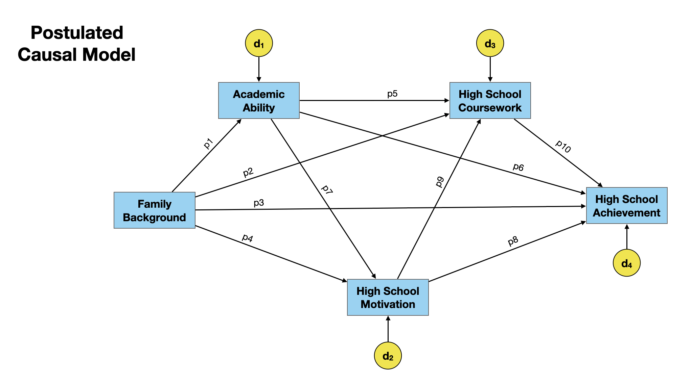
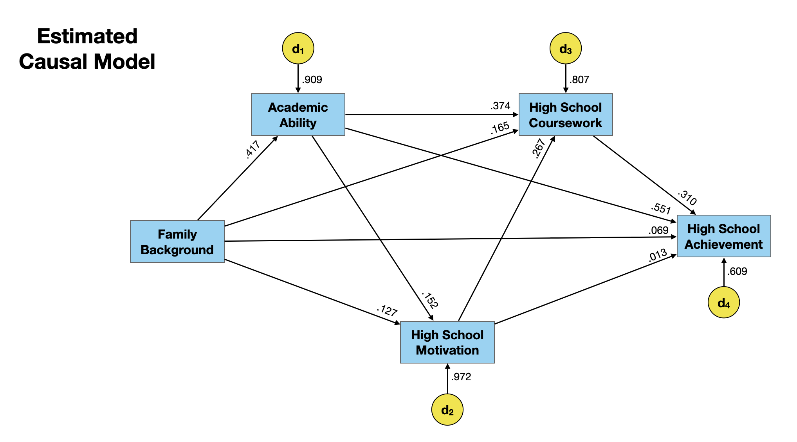
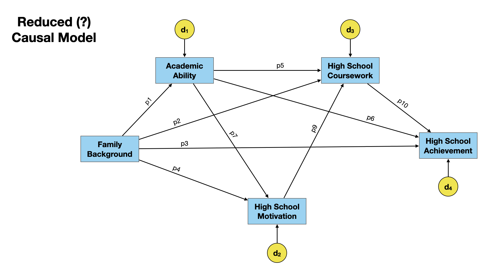

```{r knitr_init, echo=FALSE, cache=FALSE, message=FALSE}
library(knitr)
library(kableExtra)
library(rmdformats)

## Global options
options(max.print = "75")
opts_chunk$set(
  echo=TRUE,
  prompt=FALSE, 
  comment=NA, 
  message=FALSE, 
  warning=FALSE, 
  tidy=FALSE, 
  fig.width=6, 
  fig.height=6,
  fig.align='center', 
  out.width='40%'
  )
#opts_knit$set(width=85)
options(scipen=5)
options(max.print=1000000)
```

In this set of notes, we will use the data from *path-model-achievement.csv* to fit a path model to explain effects on high school achievement. 

- [[CSV]](https://raw.githubusercontent.com/zief0002/epsy-8264/master/data/path-model-achievement.csv)
- [[R Script File]](https://raw.githubusercontent.com/zief0002/epsy-8264/master/scripts/f21-17-path-analysis-02.R)


The data were simulated to include attributes for 1000 students from information provided by @Keith:2015.

```{r}
# Load libraries
library(tidyverse)
library(broom)
library(lavaan)

# Import data
keith = read_csv("https://raw.githubusercontent.com/zief0002/epsy-8264/master/data/path-model-achievement.csv")
keith
```

<br />

# Hypothesized Path Model

The hypothesized path model is shown below. This model was based on previous literature related to student achievement and on Keith's experiences as an educator and educational researcher.

```{r echo=FALSE, out.width="90%", fig.cap="Hypothesized path model for several predictors of high school achievement. "}

```

<br />

# Estimating the Path Coefficients

We need to estimate 10 path coefficients between the measured variables and four additional paths between unmeasured variables and each of the measured effects. To do this we can use a regression model that includes the hypothesized causes to predict variation in each of the effects. The regression coefficients obtained are the path coefficients between each of the hypothesized causes and effect. 

For example, the variable high school motivation is an effect in our model (i.e., it has arrows going into it). The hypothesized causes of high school motivation are family background, and academic ability. To obtain those two path coefficients:

```{r}
# Fit model
lm.motivation = lm(motivation ~ 1 + fam_back + ability, data = keith)

# Obtain path coefficients
tidy(lm.motivation)
```

The path coefficient for the path from family background to high school motivation (p4) is 0.127, and that for the path from academic ability to high school motivation (p7) is 0.152. These represent the direct effects of family background and academic ability on high school motivation, respectively. Here we interpret the direct effect of academic ability on high school motivation:

- Given the adequacy of our model, academic ability has a small positive effect on high school motivation. Each one-standard deviation increase in academic ability will result in a 0.127-standard deviation unit change on high school motivation, on average.

We can also estimate the path between the unmeasured variables ($d_2$) and high school motivation. This is computed as:

$$
\sqrt{1-R^2}
$$

where $R^2$ is the coefficient of determination from the fitted regression. In our example

```{r}
# Obtain R2
glance(lm.motivation)

# Compute path
sqrt(1 - 0.0552)
```

The path between $d_2$ and high school motivation is 0.972. This represents the effects of *all other* causes of high school motivation that we did not include in our hypothesized path model. This suggests that many of the influences of high school motivation are unaccounted for by the path model. Presumably, these are not important in positing the causal model. (Note if they are important, they should be included as measured variables in the path model.) The regression models to estimate the remaining paths are provided below (output not given), as well as the path estimates for the hypothesized path model. 

```{r eval=FALSE}
# Effect: Academic Ability
lm.abilty = lm(ability ~ 1 + fam_back, data = sim_dat)
tidy(lm.abilty)
glance(lm.abilty)
sqrt(1 - 0.174)

# Effect: High School Coursework
lm.coursework = lm(coursework ~ 1 + fam_back + ability + motivation, data = sim_dat)
tidy(lm.coursework)
glance(lm.coursework)
sqrt(1 - 0.348)

# Effect: High School Achievement
lm.achieve = lm(achieve ~ 1 + fam_back + ability + motivation + coursework, data = sim_dat)
tidy(achieve)
glance(lm.achieve)
sqrt(1 - 0.629)
```

```{r echo=FALSE, out.width="90%", fig.cap="Hypothesized path model for several predictors of high school achievement. The path estimates are also included."}

```

<br />

# Estimating Effects

We can now use the path coefficients to estimate the effects on high school achievement. Based on the hypothesized path model, each of the measured variables has a *direct effect* on high school achivement.

- The direct effect of family background on high school achievement is 0.069.
- The direct effect of academic ability on high school achievement is 0.551.
- The direct effect of high school motivation on high school achievement is 0.013.
- The direct effect of high school coursework on high school achievement is 0.310.

There are also *indirect effects* of these four causes of high school achievement. For example high school motivation not only directly influences high school achievement, but also influences it by influencing high school coursework (i.e., more motivated students take higher level courses which results in higher achievement). 

Each indirect effect is computed as the product of the path coefficients connecting the potential cause and effect. For example, the indirect effect of high school motivation on high school achievement via high school coursework is:

$$
\begin{split}
\mathrm{Indirect~Effect} &= 0.267 \times 0.310 \\[1em]
&= 0.083
\end{split}
$$

For some of these measured variables there are multiple indirect effects on achievement. The overall indirect effects are computed as the sum of each of the indirect effects. For example the indirect effects of academic ability on high school achievement are:

- Academic ability influences high school coursework which, in turn, influences high school achievement. This indirect effect is $0.374 \times 0.310 = 0.083$ 
- Academic ability influences high school motivation which, in turn, influences high school achievement. This indirect effect is $0.152 \times 0.013 = 0.002$ 
- Academic ability influences high school motivation which, in turn, influences high school coursework, which then influences high school achievement. This indirect effect is $0.152 \times 0.267 \times 0.310 = 0.013$ 

Thus the overall indirect effects of academic ability on high school achievement is:

$$
\begin{split}
\mathrm{All~Indirect~Effects} &=  (0.374 \times 0.310) + (0.152 \times 0.013) + (0.152 \times 0.267 \times 0.310) \\[1em]
&= 0.130
\end{split}
$$

The sum total of the direct and indirect effects give us the *total effect* of each hypothesized cause. For example, the total effect of academic ability on high school achievement is:

$$
\begin{split}
\mathrm{Total~Effects} &=  0.551 + 0.130 \\[1em]
&= 0.681
\end{split}
$$

Putting all of this together, 

> Given the adequacy of our model, academic ability has a fairly large, positive effect on high school achievement. Each one-standard deviation increase in academic ability will result in a 0.681-standard deviation unit change in high school achievement, on average. Much of that influence is from the direct effect of academic ability on high school achievement ($\hat\beta=0.551$). A small part of academic ability's effect on high school achievement is due to its influence on other factors (e.g., motivation) which, in turn, effect high school achievement.

The table below gives the direct, indirect, and total effects for each of the hypothesized causes of high school achievement.

```{r echo=FALSE}
data.frame(
  Measure =  c("Family Background", "Academic Ability", "High School Motivation", "High School Coursework"),
  Direct =   c("0.069", "0.551", "0.013", "0.310"),
  Indirect = c("0.348", "0.131", "0.083", "---"),
  Total =    c("0.417", "0.682", "0.096", "0.310")
)  %>%
  kable(
    caption = "Standardized direct, indirect, and total effects of substantive predictors influencing high school achievment.",
    col.names = c("Measure", "Direct", "Indirect", "Total"),
    align = c("l", "c", "c", "c"),
    format = 'html'
  ) %>%
  add_header_above(c(" " = 1, "Effect" = 3)) %>%
  kable_classic_2()
```


The largest direct influences of high school achievement are from high school coursework and academic ability. Family background also has a large influence on high school achievement, but primarily indirectly. Lastly, high school motivation has a small effect both directly and indirectly on high school achievement.


<br />

# Fitting the Path Model with lavaan

The `{lavaan}` package includes the `sem()` function, which can estimate coefficients in a path model. To use this function, we define the path model by identifying each of the effects on a separate line in a character string. This string takes the model formula from each of the `lm()` functions we fitted earlier. We can also include the path names as multipliers of the influences in this model formula. Here we use the paths from our hypothesized path model to define the effects in the path model:

```{r}
# Define path model
path.model = "
  ability ~ p1*fam_back
  motivation ~ p4*fam_back + p7*ability
  coursework ~ p2*fam_back + p5*ability + p9*motivation
  achieve ~ p3*fam_back + p6*ability + p8*motivation + p10*coursework
"
```

Then we can give this model as input to the `sem()` function along with the data frame that includes the data to estimate the model. We assign this to an object and use `summary()` to obtain the results. The `rsquare=TRUE` argument in `summary()` print the $R^2$ values, the latter of which we can use to estimate the paths from the unmeasured variables to the respective effects. You can also include other options to output additional estimates (e.g., `ci = TRUE` for confidence intervals). See [here](https://lavaan.ugent.be/tutorial/inspect.html) for additional information.

```{r}
# Fit model
pm.1 = sem(path.model, data = keith)

# Results
summary(pm.1, rsquare = TRUE)
```


We can also estimate and obtain tests for the indirect effects as well. To do this we need to add model syntax defining each indirect effect we wish to include. This model syntax uses the path names to define how to compute that effect. For example to include the indirect effect of academic ability on high school achievement via high school motivation we would add the following line into our character string:

```
indirect_ability_via_motication := p7*p8
```

The path model would then be defined and fitted:

```{r}
# Define path model
path.model.2 = "
  ability ~ p1*fam_back
  motivation ~ p4*fam_back + p7*ability
  coursework ~ p2*fam_back + p5*ability + p9*motivation
  achieve ~ p3*fam_back + p6*ability + p8*motivation + p10*coursework
  indirect_ability_via_motivation := p7*p8
"

# Fit model
pm.2 = sem(path.model.2, data = keith)

# Results
summary(pm.2, rsquare = TRUE)
```

Here the indirect effect of academic ability on high school achievement via high school motivation is not statistically significant. This is likely because the direct effect of high school motivation on high school achievement is also not statistically significant (i.e., if that path is 0 then the product we get when comouting the indirect effect will also be 0).

Here we define and compute the overall indirect effects for each of the hypothesized causes:

```{r}
# Define path model
path.model.3 = "
  ability ~ p1*fam_back
  motivation ~ p4*fam_back + p7*ability
  coursework ~ p2*fam_back + p5*ability + p9*motivation
  achieve ~ p3*fam_back + p6*ability + p8*motivation + p10*coursework
  indirect_fam_back := p1*p5*p10 + p1*p6 + p1*p7*p8 + p1*p7*p9*p10 + p4*p8 + p4*p9*p10 + p2*p10
  indirect_ability := p7*p8 + p7*p9*p10 + p5*p10
  indirect_motivation := p9*p10
"

# Fit model
pm.3 = sem(path.model.3, data = keith)

# Results
summary(pm.2, rsquare = TRUE)
```

Finally, we can fit a path model and estimate the direct, indirect, and total effects.

```{r}
# Define path model
path.model.4 = "
  ability ~ p1*fam_back
  motivation ~ p4*fam_back + p7*ability
  coursework ~ p2*fam_back + p5*ability + p9*motivation
  achieve ~ p3*fam_back + p6*ability + p8*motivation + p10*coursework
  indirect_fam_back := p1*p5*p10 + p1*p6 + p1*p7*p8 + p1*p7*p9*p10 + p4*p8 + p4*p9*p10 + p2*p10
  indirect_ability := p7*p8 + p7*p9*p10 + p5*p10
  indirect_motivation := p9*p10
  total_fam_back := p3 + p1*p5*p10 + p1*p6 + p1*p7*p8 + p1*p7*p9*p10 + p4*p8 + p4*p9*p10 + p2*p10
  total_ability := p6 + p7*p8 + p7*p9*p10 + p5*p10
  total_motivation := p8 + p9*p10
  total_coursework := p10
"

# Fit model
pm.4 = sem(path.model.4, data = keith)

# Results
summary(pm.4, rsquare = TRUE)
```

<br />

# Empirically Reducing the Model

The path between high school motivation and and high school achievement was not statistically significant (*p* = 0.546). This suggests that the effect we saw in the data may be attributable to sampling variation. One possibility is to reduce the model by removing this path. 

```{r echo=FALSE, out.width="90%", fig.cap="Reduced path model for several predictors of high school achievement. In this model the direct effect between high school motivation and high school achievement was removed (path p8)."}

```

Note that removing a path can change both direct and indirect effects. In our path model, we would need to remove any path that traverses through path p8. There are two approaches to doing this:

One approach is to remove the path and use the original estimates to re-compute the direct, indirect, and total effects. For example, to compute the indirect effects of academic ability on high school achievement we would use:


$$
\begin{split}
\mathrm{Indirect~Effects} &=  (0.374 \times 0.310)  + (0.152 \times 0.267 \times 0.310) \\[1em]
&= 0.128521
\end{split}
$$

A second approach is to re-fit the model to the empirical data.

```{r}
# Define path model
path.model.5 = "
  ability ~ p1*fam_back
  motivation ~ p4*fam_back + p7*ability
  coursework ~ p2*fam_back + p5*ability + p9*motivation
  achieve ~ p3*fam_back + p6*ability + p10*coursework
  indirect_fam_back := p1*p5*p10 + p1*p6  + p1*p7*p9*p10 + p4*p9*p10 + p2*p10
  indirect_ability := p7*p9*p10 + p5*p10
  indirect_motivation := p9*p10
  total_fam_back := p3 + p1*p5*p10 + p1*p6  + p1*p7*p9*p10 + p4*p9*p10 + p2*p10
  total_ability := p6 + p7*p9*p10 + p5*p10
  total_coursework := p10
"

# Fit model
pm.5 = sem(path.model.5, data = keith)

# Results
summary(pm.5, rsquare = TRUE)
```


The fitted path model is shown below.


Computing the indirect effects of academic ability on high school achievement for this re-fitted model we would use:


$$
\begin{split}
\mathrm{Indirect~Effects} &=  (0.374 \times 0.314)  + (0.152 \times 0.267 \times 0.314) \\[1em]
&= 0.1301794
\end{split}
$$

The differences are minimal; in this case only one of the path coefficients changed when rounded to three decimal places.

